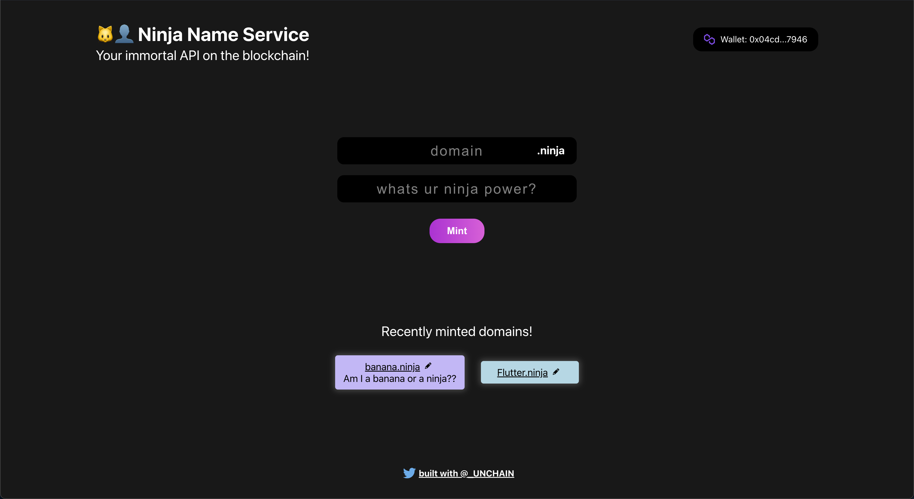

<p align="center">
  <br />
  
  <br/>
  <br />
  <p align="center">


</p>

<br/>

[](#table-of-contents)

<br/>

## • Overview

This project is made following [this instructions](https://app.unchain.tech/learn/Polygon-ENS-Domain/) made by engineer cmmunity `UNCHAIN`. This one is one of the best one to learn blockchain development.

This is a dApp that you can get ens on mumbai testnet. You can mint it and view your own domains from through this dApp.

## • Links

[Deployed here](https://polygon-ens-domain-client.vercel.app/)

[](https://polygon-ens-domain-client.vercel.app/)

## • Launch

1. run `yarn install` in terminal.

2. make `.env` file under `packages/contract` and input your `Private Key` and `Alchemy HTTP Key` like below.

```
PRIVATE_KEY = <YOUR_PRIVATE_KEY>
STAGING_ALCHEMY_KEY = <ALCHEMY_HTTP_KEY>
```

3. run `yarn contract deploy` in terminal. The result would be like below.

```
Contract deployed to: 0x6C45313E2F7e4Fd85f56E66c559bfFc23E726c1d
Minted domain banana.ninja
Set record for banana.ninja
Owner of domain banana: 0xf280e1A88D8eE02140828C8BD06DE71b3483Fd69
Contract balance: 0.01
```

4. change the line 6 in `packages/client/src/App.js`.

```javascript
const contractAddress = 'YOUR_CONTRACT_ADDRESS';
```

5. replace the json file in `packages/client/src/utils/contractABI.json` with the content of the json file in `packages/contract/artifacts/contracts/Domains.sol/Domains.json`.

6. Finally, run `yarn client start` in terminal and see how it works!
